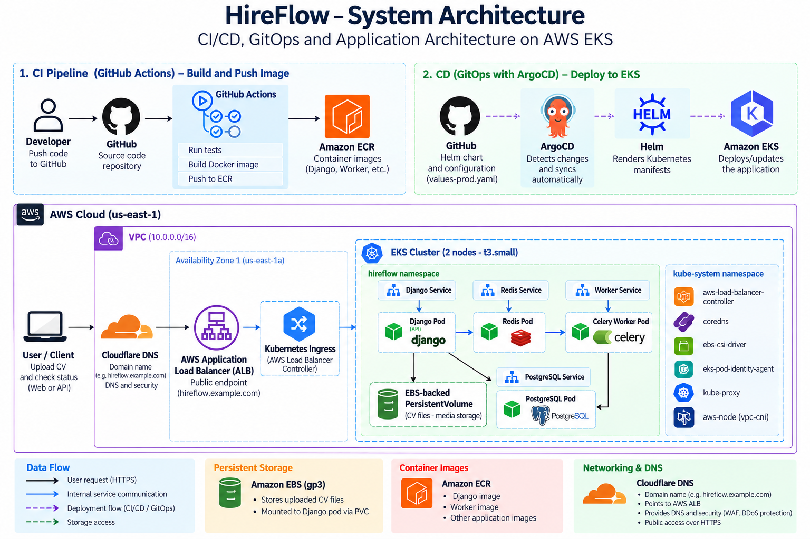

# HireFlow — System Architecture

## 1. Overview

HireFlow is a cloud-native document processing platform designed to process candidate CVs and extract structured candidate information.

The application exposes a REST API for document uploads and processing status. Uploaded documents are processed asynchronously using Celery workers with Redis as the message broker. PostgreSQL stores application metadata and extracted candidate information.

The application is containerized with Docker and deployed to Amazon EKS using Kubernetes and Helm. GitHub Actions handles the CI pipeline and publishes container images to Amazon ECR. ArgoCD provides GitOps-based continuous delivery by synchronizing the Kubernetes deployment with the Helm configuration stored in GitHub.

### Current architecture

- **Application:** Django + Django REST Framework
- **Database:** PostgreSQL
- **Background processing:** Celery
- **Message broker:** Redis
- **Containerization:** Docker
- **Orchestration:** Kubernetes on Amazon EKS
- **Packaging:** Helm
- **Container registry:** Amazon ECR
- **CI:** GitHub Actions
- **CD/GitOps:** ArgoCD
- **Ingress:** AWS Application Load Balancer
- **Persistent file storage:** Kubernetes PersistentVolume backed by Amazon EBS
- **Planned object storage:** Amazon S3
- **Planned monitoring:** Prometheus and Grafana

## 2. Architecture Diagram

The following diagram shows the current HireFlow architecture, including the CI/CD pipeline, GitOps deployment flow, AWS infrastructure, and application components.



## 3. Application Architecture

HireFlow follows an API-first architecture where document uploads are handled by Django REST Framework and long-running document processing is performed asynchronously by Celery workers.

### Document Processing Flow


```
Client
  │
  │ POST /api/documents/
  ▼
Django REST API
  │
  ├── Create document record
  │       │
  │       ▼
  │   PostgreSQL
  │
  └── Queue processing task
          │
          ▼
        Redis
          │
          ▼
    Celery Worker
          │
          ├── Read uploaded PDF
          ├── Extract text
          ├── Parse candidate information
          │
          ▼
      PostgreSQL
          │
          │ Status updated
          ▼
    Django SSE Endpoint
          │
          ▼
       SSE Client
```

## Main Components

### Django REST API

The Django REST API provides the main interface for interacting with HireFlow.
Responsibilities include:

* Accepting CV uploads
* Creating document records
* Exposing document status
* Providing candidate information through the API
* Exposing Server-Sent Events for processing updates

### PostgreSQL

PostgreSQL stores application metadata and extracted candidate information.
Stored information includes:

* Document metadata
* Original filename
* Processing status
* Candidate name
* Candidate email
* Candidate phone
* Processing timestamps

### Redis

Redis acts as the message broker between Django and Celery.
When a document is uploaded, Django submits a background processing task to Redis. The Celery worker retrieves the task and processes the document asynchronously.

### Celery Worker

The Celery worker performs the long-running document processing outside the HTTP request.
The worker:

1. Retrieves the uploaded document
2. Extracts text from the PDF
3. Parses candidate information
4. Updates the document record
5. Marks the document as `COMPLETED` or `FAILED`

This prevents document processing from blocking the API request.

### Server-Sent Events

HireFlow uses Server-Sent Events (SSE) to provide processing status updates to clients.
The client can maintain an HTTP connection to:

```
/api/documents/<id>/events/
```

and receive status changes from the server without repeatedly polling the API.

## 4. Kubernetes Architecture

HireFlow is deployed to Kubernetes on an Amazon EKS cluster. Kubernetes manages the application containers, networking, persistent storage, and application health.

### Kubernetes Namespace

HireFlow runs in its own Kubernetes namespace:

```text
hireflow
```

The namespace contains the main application components:

* Django API
* PostgreSQL
* Redis
* Celery Worker
* Persistent storage resources
* Kubernetes Services and Deployments

### Application Components

The main application workloads are deployed as Kubernetes Deployments:

```
hireflow namespace
│
├── Django Deployment
│     └── Django Pod
│
├── Celery Worker Deployment
│     └── Worker Pod
│
├── PostgreSQL Deployment
│     └── PostgreSQL Pod
│
└── Redis Deployment
      └── Redis Pod
```

Kubernetes Services provide stable networking between the application components.

```
Django Service
      │
      ├── Django Pod
      │
      └── Django API

PostgreSQL Service
      │
      └── PostgreSQL Pod

Redis Service
      │
      └── Redis Pod
```

### Helm

HireFlow is packaged and deployed using Helm.
The Helm chart contains Kubernetes manifests for:

* Deployments
* Services
* ConfigMaps
* PersistentVolumeClaims
* Ingress
* Application configuration

Environment-specific configuration is managed through Helm values files.
The production deployment currently uses:

```
values-prod.yaml
```

This separates application configuration from the Kubernetes resource templates.

### Persistent Storage

HireFlow uses Kubernetes PersistentVolumeClaims for persistent data.
The current deployment uses Amazon EBS-backed storage through the AWS EBS CSI driver.
The media volume stores uploaded documents independently of the Django container lifecycle.
The PostgreSQL database also uses persistent storage to prevent database data from being lost when the PostgreSQL pod is recreated.

### Health and Readiness

The Django application exposes two endpoints for Kubernetes health checks:

```
/health/
/ready/
```

The liveness probe uses `/health/` to determine whether the application container is functioning.
The readiness probe uses `/ready/` to verify that Django can successfully communicate with PostgreSQL.
This allows Kubernetes to remove the application from service when its dependencies are unavailable without unnecessarily restarting the container.

### Self-Healing

Kubernetes automatically recreates application pods when a pod is deleted or becomes unavailable.
For example:

```
Django Pod
    │
    │ Pod deleted
    ▼
Kubernetes Deployment
    │
    │ Creates replacement
    ▼
New Django Pod
```

This provides basic workload self-healing without manual intervention.

### EKS Cluster

The Kubernetes cluster runs on Amazon EKS using two `t3.small` worker nodes.
The nodes are distributed across two Availability Zones:

```
Amazon EKS
│
├── us-east-1a
│     └── t3.small
│
└── us-east-1b
      └── t3.small
```

This provides basic distribution of workloads across Availability Zones while keeping the development infrastructure relatively small.

## 5. AWS Infrastructure

HireFlow runs on Amazon Web Services (AWS) using Amazon EKS as the Kubernetes platform.

The current infrastructure is deployed in the `us-east-1` region.

### AWS Architecture

The main AWS components are:

- Amazon VPC
- Amazon EKS
- EC2 worker nodes
- Application Load Balancer
- Amazon EBS
- AWS Load Balancer Controller
- AWS EBS CSI Driver
- IAM
- Amazon ECR

### Amazon VPC

The EKS cluster runs inside a dedicated VPC.

The VPC provides the network boundary for the Kubernetes infrastructure and contains public and private subnets distributed across multiple Availability Zones.

The public networking components support external access to the application through the Application Load Balancer, while private networking is used for internal cluster resources.

### Amazon EKS

Amazon EKS provides the managed Kubernetes control plane for HireFlow.

The cluster currently uses two EC2 `t3.small` worker nodes distributed across two Availability Zones:

```text
Amazon EKS
│
├── us-east-1a
│     └── EC2 t3.small
│
└── us-east-1b
      └── EC2 t3.small
```

Kubernetes schedules the HireFlow workloads across these worker nodes according to available resources and scheduling constraints.

### Application Load Balancer

External traffic reaches HireFlow through an AWS Application Load Balancer (ALB).
The traffic flow is:

```
Client
   │
   ▼
Application Load Balancer
   │
   ▼
Kubernetes Ingress
   │
   ▼
Django Service
   │
   ▼
Django Pod
```

The AWS Load Balancer Controller manages the ALB from Kubernetes resources.
This allows the Kubernetes Ingress configuration to define how external HTTP traffic is routed to the application.

### Amazon EBS

Amazon EBS provides persistent block storage for Kubernetes workloads.
HireFlow currently uses EBS-backed Kubernetes PersistentVolumes for:

* Uploaded media files
* PostgreSQL data

The AWS EBS CSI driver allows Kubernetes to provision and attach EBS volumes to worker nodes.
Because EBS volumes use `ReadWriteOnce`, the Django deployment uses a `Recreate` strategy to avoid temporarily running multiple pods that attempt to mount the same volume during a deployment.

### Amazon ECR

Amazon Elastic Container Registry (ECR) stores the Docker image used by the HireFlow application.
The CI pipeline builds the Docker image and pushes it to ECR.
The Kubernetes deployment then pulls the image from the repository when creating the Django application pod.
The overall flow is:

```
Developer
    │
    ▼
GitHub
    │
    ▼
GitHub Actions
    │
    │ Build Docker image
    ▼
Amazon ECR
    │
    │ Pull image
    ▼
Amazon EKS
```

### IAM

AWS Identity and Access Management (IAM) controls permissions for the AWS resources used by HireFlow.
IAM is used for:

* GitHub Actions authentication through AWS OIDC
* EKS-related AWS permissions
* AWS Load Balancer Controller permissions
* EBS CSI driver permissions

GitHub Actions uses OpenID Connect (OIDC) to authenticate with AWS without storing long-lived AWS access keys in GitHub repository secrets.

### AWS Load Balancer Controller

The AWS Load Balancer Controller runs inside the Kubernetes cluster and manages AWS load-balancing resources based on Kubernetes configuration.
For HireFlow, it is responsible for creating and managing the Application Load Balancer associated with the application's Ingress.

### AWS EBS CSI Driver

The AWS EBS Container Storage Interface (CSI) driver connects Kubernetes persistent storage with Amazon EBS.
It allows Kubernetes to attach and mount EBS volumes to the worker node where a workload requiring persistent storage is scheduled.
This provides persistent storage while keeping storage management integrated with Kubernetes.

## 6. CI/CD & GitOps

HireFlow uses GitHub Actions for Continuous Integration (CI) and ArgoCD with Helm for GitOps-based Continuous Delivery (CD).

GitHub acts as the source of truth for both the application source code and Kubernetes deployment configuration.

### Continuous Integration

GitHub Actions runs automatically when changes are pushed to the `main` branch or when a pull request targets `main`.

The CI pipeline performs the following steps:

1. Check out the repository
2. Configure AWS credentials using OpenID Connect (OIDC)
3. Authenticate with Amazon ECR
4. Set up Python 3.12
5. Install application dependencies
6. Run Django system checks
7. Run automated tests
8. Build the Docker image
9. Push the Docker image to Amazon ECR

A PostgreSQL 16 service container is used during the CI job so that Django checks and application tests can run against PostgreSQL.

### Docker Image Tagging

Docker images are tagged using the Git commit SHA:

```text
${{ github.sha }}
```

This creates a traceable relationship between a container image in Amazon ECR and the Git commit that produced it.
For example:

```text
784055307315.dkr.ecr.us-east-1.amazonaws.com/hireflow:<commit-sha>
```

### AWS Authentication

GitHub Actions authenticates with AWS using OpenID Connect (OIDC).
The workflow assumes an AWS IAM role:

```text
HireFlowGitHubActions
```

This avoids storing long-lived AWS access keys in GitHub repository secrets.
The workflow receives temporary AWS credentials and uses them to authenticate with Amazon ECR.

```
GitHub Actions
      │
      │ OIDC
      ▼
AWS IAM
      │
      │ Temporary credentials
      ▼
Amazon ECR
```

### Amazon ECR

Amazon ECR stores the Docker images produced by the CI pipeline.
The image is pushed to:

```text
784055307315.dkr.ecr.us-east-1.amazonaws.com/hireflow
```

Kubernetes uses this repository as the source for the HireFlow application container image.

### GitOps with ArgoCD

ArgoCD manages the Kubernetes deployment using the Helm chart stored in GitHub.
The ArgoCD Application points to:

| Field | Value |
|---|---|
| Repository | `https://github.com/Konigdave/hireflow-platform.git` |
| Path | `infrastructure/helm/hireflow` |
| Branch | `main` |

The production deployment uses `values-prod.yaml`, which contains the ECR repository and the image tag used by the Kubernetes deployment.

ArgoCD continuously compares the desired state stored in Git with the live state of the Kubernetes cluster.

```
GitHub
   │
   │ Desired Kubernetes configuration
   ▼
ArgoCD
   │
   ▼
Helm
   │
   ▼
Amazon EKS
```

### Automated Synchronization

The ArgoCD application uses automated synchronization with the following options enabled:

- `prune` — removes resources that are no longer defined in Git
- `selfHeal` — restores resources when the live Kubernetes state differs from the desired state in Git

### Current CI/CD Boundary

The current implementation separates the CI and CD stages.

GitHub Actions automatically builds and publishes a new Docker image to Amazon ECR. ArgoCD automatically synchronizes changes to the Kubernetes configuration stored in Git. The current GitHub Actions workflow does not automatically modify `values-prod.yaml` after pushing a new image, so updating the image version in the Kubernetes deployment currently requires a manual change to the Helm configuration in Git.

```
Application change
       │
       ▼
GitHub
       │
       ▼
GitHub Actions
       │
       ├── Test
       ├── Build
       └── Push image
                 │
                 ▼
              Amazon ECR

Deployment configuration change
       │
       ▼
GitHub
       │
       ▼
     ArgoCD
       │
       ▼
      Helm
       │
       ▼
    Amazon EKS
```

This separation keeps the Kubernetes desired state explicitly version-controlled in Git.

### GitOps Deployment

When the image tag in `values-prod.yaml` is changed and committed to Git:

```
values-prod.yaml
        │
        ▼
     GitHub
        │
        ▼
     ArgoCD
        │
        │ Detect change
        ▼
      Helm
        │
        ▼
    Amazon EKS
        │
        ▼
New HireFlow image
```

This provides:

- Git as the source of truth
- Version-controlled deployment configuration
- Traceable deployment history
- Automated synchronization
- Automatic reconciliation
- Recovery from configuration drift

## 7. Application Flow

The HireFlow document processing workflow separates the upload request from the document processing task.

This allows the API to respond quickly while the CV is processed asynchronously by a Celery worker.

### CV Upload Flow

```text
Client
  │
  │ 1. Upload CV
  ▼
Django REST API
  │
  ├── 2. Validate request
  │
  ├── 3. Save document
  │        │
  │        ▼
  │    PostgreSQL
  │
  └── 4. Queue Celery task
           │
           ▼
         Redis
           │
           │ 5. Retrieve task
           ▼
     Celery Worker
           │
           ├── 6. Read PDF
           ├── 7. Extract text
           ├── 8. Parse candidate information
           │
           ▼
       PostgreSQL
           │
           │ 9. Update status
           ▼
    Django SSE Endpoint
           │
           │ 10. Status update
           ▼
         Client
```

### 1. Document Upload

The client sends a `POST` request to:

```
/api/documents/
```

The request contains the candidate's CV as an uploaded file.
Django REST Framework receives and validates the request.

### 2. Document Creation

After validation, Django creates a document record in PostgreSQL.
The document initially has a `PENDING` processing status.
The uploaded file is stored using the application's configured media storage.

### 3. Background Task

After the document is saved, Django queues a Celery task containing the document ID.
The task is sent to Redis, which acts as the message broker.
The API does not wait for the document processing to finish.

### 4. Document Processing

The Celery worker retrieves the task from Redis and begins processing the document.
The document status is changed to:

```
PROCESSING
```

The worker then:

1. Reads the uploaded PDF
2. Extracts the text
3. Parses candidate information
4. Stores the extracted information in PostgreSQL

The current parser extracts information such as:

* Candidate name
* Email address
* Phone number

### 5. Processing Completion

After successful processing, the document status is changed to:

```
COMPLETED
```

If processing fails, the status is changed to:

```
FAILED
```

This allows the client to determine the final processing state of the document.

### 6. Status Updates

HireFlow exposes a Server-Sent Events endpoint:

```
/api/documents/<id>/events/
```

The client can connect to this endpoint to receive processing status updates without repeatedly polling the API.
The general status lifecycle is:

```
PENDING
   │
   ▼
PROCESSING
   │
   ├──────────────► COMPLETED
   │
   └──────────────► FAILED
```

### Asynchronous Processing

The processing workflow is intentionally asynchronous.
Instead of keeping the HTTP request open while the PDF is processed:

```
HTTP Request
     │
     ▼
Upload document
     │
     ▼
Queue task
     │
     ▼
Return response
```

The actual processing happens independently:

```
Redis
  │
  ▼
Celery Worker
  │
  ▼
PDF Processing
  │
  ▼
PostgreSQL
```

This separation prevents potentially slow document processing from blocking the API request.

## 8. Storage Strategy

HireFlow separates application metadata from uploaded document storage.

PostgreSQL stores document metadata and extracted candidate information, while uploaded CV files are stored separately from the database.

### Current Storage Architecture

The current Kubernetes deployment uses an Amazon EBS-backed PersistentVolume for uploaded CV files.

The storage flow is:

```text
Django Pod
    │
    ▼
PersistentVolumeClaim
    │
    ▼
Amazon EBS
    │
    ▼
Uploaded CV files
```

The media volume is mounted into the Django application and provides persistent storage beyond the lifecycle of an individual Django container.

### PostgreSQL Storage

PostgreSQL uses its own persistent volume.

```
PostgreSQL Pod
      │
      ▼
PersistentVolumeClaim
      │
      ▼
Amazon EBS
      │
      ▼
PostgreSQL data
```

This prevents database data from being lost when the PostgreSQL pod is recreated.

### PersistentVolume Configuration

The current production deployment uses Amazon EBS `gp3` storage.
The media PersistentVolume is configured with:

```
Storage class: gp3
Capacity: 10Gi
Access mode: ReadWriteOnce
```

Because the EBS volume uses `ReadWriteOnce`, the volume can be mounted for read/write access by a single node at a time.
This influenced the Kubernetes deployment strategy for the Django application.

### Storage and Application Lifecycle

Persistent storage allows uploaded files and database data to survive application pod recreation.
For example:

```
Django Pod
    │
    │ Pod recreated
    ▼
New Django Pod
    │
    ▼
Same PersistentVolume
    │
    ▼
Existing uploaded files
```

The application container itself is therefore treated as replaceable, while persistent data is stored outside the container filesystem.

### Planned S3 Migration

Amazon S3 is planned as the future storage backend for uploaded CV files.
The planned architecture is:

```
Django
   │
   ▼
Amazon S3
   │
   └── Uploaded CV files

PostgreSQL
   │
   └── Document metadata
```

Moving document storage to S3 would separate object storage from the Kubernetes cluster and reduce the application's dependency on node-attached persistent volumes.
The S3 migration is planned but is not part of the current production deployment.

## 9. Reliability & Self-Healing

HireFlow uses Kubernetes health checks, readiness checks, and Deployment controllers to improve application reliability and reduce the need for manual intervention.

### Liveness Checks

The Django application exposes:

```text
/health/
```

Kubernetes uses this endpoint as the liveness probe.
The endpoint confirms that the Django application process is responding.
If the container becomes unhealthy and fails the configured liveness checks, Kubernetes can restart the container.

### Readiness Checks

The Django application also exposes:

```
/ready/
```

The readiness endpoint verifies that Django can communicate with PostgreSQL.
Kubernetes uses this endpoint as the readiness probe.
A pod that is running but not ready is removed from Service traffic while Kubernetes continues to keep the container running.
This distinction is important because an unavailable dependency does not necessarily mean that the application process itself needs to be restarted.

### Dependency Failure Handling

The readiness check was tested by temporarily stopping the PostgreSQL deployment.
The observed behavior was:

```
PostgreSQL unavailable
       │
       ▼
Django /ready/ → HTTP 503
       │
       ▼
Django Pod → Not Ready
       │
       ▼
No application traffic sent to the pod
```

When PostgreSQL was restored:

```
PostgreSQL available
       │
       ▼
Django /ready/ → HTTP 200
       │
       ▼
Django Pod → Ready
       │
       ▼
Application traffic resumes
```

The Django container did not need to be restarted because the liveness check remained healthy.

### Kubernetes Self-Healing

Kubernetes Deployments maintain the desired number of application replicas.
If a Django pod is deleted:

```
Django Pod
    │
    │ Deleted
    ▼
Deployment Controller
    │
    │ Detects missing replica
    ▼
New Django Pod
    │
    ▼
Readiness checks
    │
    ▼
Pod becomes Ready
```

This allows Kubernetes to automatically restore the desired application state.

### GitOps Self-Healing

ArgoCD provides another layer of reconciliation.
The desired Kubernetes configuration is stored in Git.
If the live Kubernetes configuration is changed outside the Git-managed configuration, ArgoCD can detect the difference and restore the desired state through its `selfHeal` configuration.

```
Git
 │
 │ Desired state
 ▼
ArgoCD
 │
 │ Reconciliation
 ▼
Kubernetes
```

This provides two complementary forms of recovery:

* Kubernetes maintains the desired number and health of application workloads.
* ArgoCD maintains the desired configuration defined in Git.

## 10. Security

Security considerations are incorporated into the application, container, Kubernetes, and AWS infrastructure layers.

### Environment Variables

Application configuration and credentials are provided through environment variables rather than being hardcoded into the application source code.

Sensitive configuration includes:

- PostgreSQL credentials
- Database connection information
- Redis connection information
- Django configuration

A `.env.example` file is maintained as a template for required environment variables without containing actual secrets.

### Container Security

The Django application runs as a non-root user inside the Docker container.

This reduces the privileges available to the application process and follows the principle of least privilege at the container level.

### AWS IAM

AWS access is controlled using IAM roles and policies.

GitHub Actions uses OpenID Connect (OIDC) to authenticate with AWS rather than storing long-lived AWS access keys.

The AWS Load Balancer Controller and other AWS-integrated Kubernetes components use dedicated AWS permissions.

### Kubernetes Configuration

Application configuration is separated from container images using Kubernetes configuration resources and Helm values.

This allows configuration to be changed without modifying the application image.

### Django Host Validation

Django uses `ALLOWED_HOSTS` to restrict which HTTP Host headers are accepted by the application.

The production configuration explicitly defines the allowed application hostname and required internal hostname.

This prevents requests with unexpected Host headers from being accepted by Django.

### Health Endpoint Separation

The application uses separate health and readiness endpoints:

```text
/health/
/ready/
```

The health endpoint is used to determine whether the application process is functioning.

The readiness endpoint verifies application dependency availability before allowing the pod to receive traffic.

### Network Access

The application is exposed through an AWS Application Load Balancer rather than directly exposing the Django pod.

Kubernetes Services provide internal communication between Django, PostgreSQL, Redis, and the Celery worker.

### Current Security Scope

The current implementation focuses on infrastructure and application-level security appropriate for a portfolio and development environment.

Additional production security measures are planned, including:

- HTTPS/TLS configuration
- Centralized secret management
- More restrictive network policies
- Resource-level IAM hardening
- Database backup and recovery procedures
- Application authentication and authorization

## 11. Current Limitations

HireFlow is currently a portfolio and learning project, so several components have intentionally been kept simple.

### Storage

Uploaded CV files are currently stored on an EBS-backed Kubernetes PersistentVolume.

This works for the current deployment but creates a dependency on Kubernetes persistent storage.

Amazon S3 is planned as the future object-storage solution.

### Application Authentication

The current API does not implement a full user authentication and authorization system.

Authentication and role-based access control are planned for a future iteration.

### CV Parsing

The current CV parser uses a lightweight rule-based approach.

It extracts common candidate fields such as:

- Name
- Email
- Phone number

It does not yet provide advanced CV understanding or reliable extraction from highly varied document formats.

### Monitoring

The current deployment does not include a full Prometheus and Grafana monitoring stack.

Kubernetes health checks and application endpoints provide basic health information, but comprehensive metrics, dashboards, and alerting are planned.

### High Availability

The current application uses a small EKS cluster with two `t3.small` worker nodes and a single Django replica.

This keeps the infrastructure suitable for a development and portfolio environment but does not provide the level of redundancy expected for a production system.

### CI/CD Automation

GitHub Actions automatically tests the application, builds the Docker image, and pushes it to Amazon ECR.

The current workflow does not automatically update the Helm image tag after pushing a new image.

The Kubernetes image version is therefore changed through the Git-managed Helm configuration, which ArgoCD then synchronizes.

### Secrets Management

Application configuration currently uses environment variables and Kubernetes configuration resources.

A dedicated secret-management solution such as AWS Secrets Manager is planned for a more production-oriented deployment.

### Infrastructure Cost

The current AWS infrastructure is intentionally small, but running an EKS cluster and supporting AWS resources continuously generates costs.

The infrastructure can be stopped or destroyed when it is not required for testing or demonstrations.

## 12. Future Improvements

The current HireFlow implementation provides the core document-processing and DevOps platform. The following improvements are planned as the project evolves toward a more production-oriented architecture.

### Amazon S3 Storage

Migrate uploaded CV files from the Kubernetes EBS-backed PersistentVolume to Amazon S3.

Benefits include:

- Object storage independent of Kubernetes nodes
- Better scalability for uploaded documents
- Easier integration with other AWS services
- Reduced dependency on ReadWriteOnce volumes

### Application Authentication

Introduce authentication and authorization for API users.

Future versions could include:

- User accounts
- Token-based authentication
- Role-based access control
- Protected document access

### Improved CV Parsing

Expand the current rule-based parser to support more structured candidate extraction.

Potential improvements include:

- Education history
- Work experience
- Skills
- Certifications
- Multiple phone numbers and email formats
- More complex CV layouts
- Structured candidate profiles

### Automated Image Promotion

Improve the CI/CD pipeline by automatically updating the Helm image tag after a successful Docker image build.

The future workflow could become:

```text
Git push
   │
   ▼
GitHub Actions
   │
   ├── Run tests
   ├── Build image
   └── Push image to ECR
          │
          ▼
    Update image tag
          │
          ▼
      Git commit
          │
          ▼
       ArgoCD
          │
          ▼
        EKS
```

This would create a more fully automated CI/CD pipeline while keeping Git as the source of truth for Kubernetes deployments.

### Monitoring and Observability

Introduce Prometheus and Grafana for application and infrastructure monitoring.

Planned capabilities include:

- Kubernetes metrics
- Application metrics
- CPU and memory utilization
- Request metrics
- Celery worker metrics
- PostgreSQL metrics
- Dashboards
- Alerting

### Production Secret Management

Move sensitive application configuration to a dedicated secret-management solution such as AWS Secrets Manager.

This would reduce the dependency on manually managed environment variables and provide centralized secret management.

### HTTPS

Configure HTTPS/TLS for the public application endpoint.

The future architecture will use a managed certificate and HTTPS termination at the application load-balancing layer.

### Infrastructure Hardening

Additional infrastructure improvements could include:

- More restrictive security groups
- Kubernetes NetworkPolicies
- More granular IAM permissions
- Resource requests and limits
- Pod disruption budgets
- Automated database backups
- Disaster recovery procedures

### Development and Production Environments

Introduce separate development and production configurations.

Terraform modules and Helm values can be used to maintain environment-specific configuration while reusing common infrastructure and deployment patterns.

The environments would remain logically separated while sharing reusable infrastructure definitions.

### Scalability

As usage increases, HireFlow could be expanded through:

- Multiple Django replicas
- Horizontal Pod Autoscaling
- Multiple Celery workers
- Redis improvements or a managed Redis service
- Managed PostgreSQL
- S3-based document storage
- Additional EKS capacity

These improvements would allow the architecture to evolve from a portfolio-scale deployment toward a more production-oriented platform.
